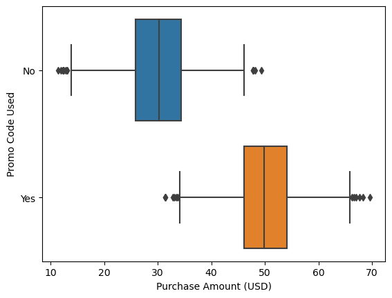

# shopping-behavior

Explore the data by understanding what kind of data and show data visualiation like bar chart, boxplot, and histplot,then tranform data by deleting missing columns and regroup the columns and create a new date set.

I also learned about the difference between bivariate visualizations and univariate visualizations, such as finding trends & patterns, and analyze the data such as using p-value and T statisitcs. For instance, when consumers use promote code, they tend to purchase more products. For consumers who does not use promo code, they spend less than for consumers who use promo code. The average price for people who use promo code is 50 dollars while the average price for people who do not use promo codee is 30 dollars. 

I used Python, Pandas, Jupyter to complete the assignment. 

## Observations 

By analyzing shopping data, I can understand people's shopping behaviors and how age differences and seasonal change affect consumers' spending. It is interesting to know that people who have high spending tend to write more reviews. 

It is challenging to clean the data, such as using the funcation of "fillna" and "replace" for missing value, but I reserached the Python documentation based on the link provided to identiy the right function. 

